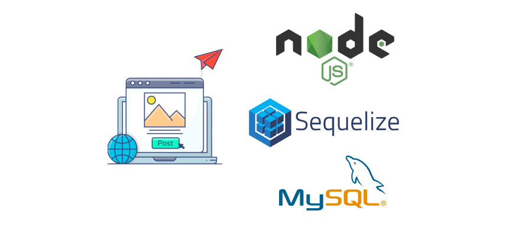

# 💻 Blogs API



## 📡 Desenvolvimento

Projeto desenvolvido na <a href="https://betrybe.com/" target="_blank">Trybe</a> durante o módulo de Back-End!

Nesse projeto foi desenvolvido uma API RESTful utilizando a arquitetura MSC (Model-Service-Controller) de blog, onde é possivel criar, visualizar, deletar e atualizar posts, categorias e usuários! A conexão com o banco de dadas foi feita com o ORM Sequelize e a autenticação com Json Web Token.

Decidi implementar testes unitários a parte, cobrindo um total de 100% das funcionalidades da API, para praticar e garantir que a aplicação funcione corretamente!

## 📚 Documentação

<details>
<summary>Instalação e execução com Docker</summary>
<br />

Para rodar está aplicação é necessário ter **Git**, **Docker** e o **Docker Compose** instalados no seu computador. O Docker Compose precisa estar na versão **1.29** ou superior.

### 1 - Clone o repositório:

```
git clone git@github.com:lauropera/blogs-api.git
```

### 2 - Na raíz do projeto, suba os containers `blogs_api` e `blogs_api_db` utilizando o docker-compose.

    docker-compose up -d

### 3 - Abra o terminal do container `blogs_api`.

    docker exec -it blogs_api bash

### 4 - No terminal do container, instale as dependências com o comando:

    npm install

### 5 - Agora execute os comandos para criar e popular o banco de dados:

Criando as tabelas

    npm run prestart

Populando o banco com dados

    npm run seed

### 6 - Agora execute a aplicação com o comando:

    npm start

Para conferir a cobertura de testes execute o comando:

    npm run test-coverage

### 7 - Acesse a documentação e faça requisições para o servidor aberto na porta 3000

Acesse a rota http://localhost:3000/docs para acessar a documentação e testar a API. Se preferir, utilize um cliente de requisições HTTP de sua preferência (Insomnia, Thunder Client, etc) para fazer as requisições.

</details>
<br />

## ⚙️ Tecnologias

- Node.js
- Express.js
- Sequelize.js
- Json Web Tokens
- DotEnv
- Joi
- Mocha.js
- Chai.js
- Sinon.js
- Docker
- MySQL
- Swagger

#

## 🧪 Cobertura de testes


#

<div>
  <p align="center">🍐</p>
</div>
